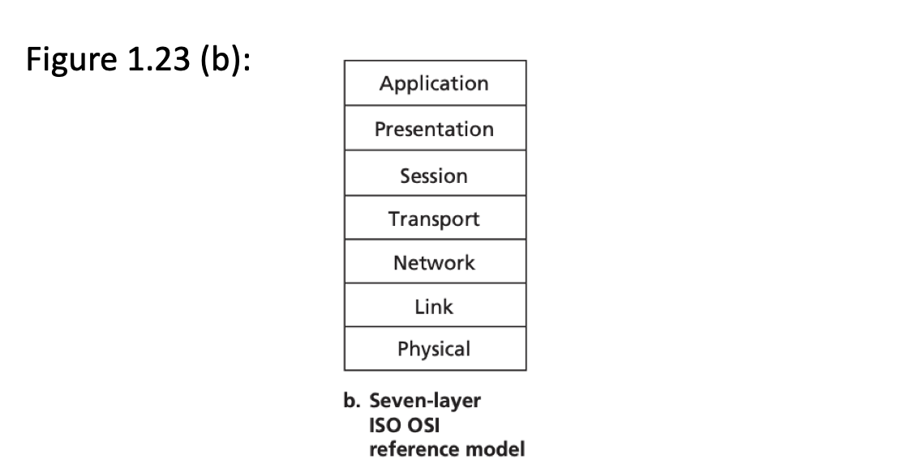

# Computer Networks and the Internet

### Chapter 1 contents
* What Is the internet?
* The Network Edge
* The Network Core
* Delay, Loss, And Troughput in Packet-Switched Networks
* Protocol Layers and Their Service Models
* Networks Under Attack
* History of Computer Networking and the Internet

### Internet protocol stack

Application Layer

The application layer is where network applications and their application-layer protocols reside. The Internet’s application layer includes many protocols, such as the HTTP protocol (which provides for Web document request and transfer), SMTP (which provides for the transfer of e-mail messages), and FTP (which provides for the transfer of files between two end systems). We’ll see that certain network functions, such as the translation of human-friendly names for Internet end systems like www.ietf.org to a 32-bit network address, are also done with the help of a specific application-layer protocol, namely, the domain name system (DNS). We’ll see in Chapter 2 that it is very easy to create and deploy our own new application-layer protocols. An application-layer protocol is distributed over multiple end systems, with the application in one end system using the protocol to exchange packets of information with the application in another end system. We’ll refer to this packet of information at the application layer as a message. 

Transport Layer

The Internet’s transport layer transports application-layer messages between application endpoints. In the Internet there are two transport protocols, TCP and UDP, either of which can transport application-layer messages. TCP provides a connection-oriented service to its applications. This service includes guaranteed delivery of application-layer messages to the destination and flow control (that is, sender/receiver speed matching). TCP also breaks long messages into shorter segments and provides a congestion-control mechanism, so that a source throttles its transmission rate when the network is congested. The UDP protocol provides a connectionless service to its applications. This is a no-frills service that provides no reliability, no flow control, and no congestion control. In this book, we’ll refer to a transport-layer packet as a segment.

 

Network Layer

The Internet’s network layer is responsible for moving network-layer packets known as datagrams from one host to another. The Internet transport-layer protocol (TCP or UDP) in a source host passes a transport-layer segment and a destination address to the network layer, just as you would give the postal service a letter with a destination address. The network layer then provides the service of delivering the segment to the transport layer in the destination host. The Internet’s network layer includes the celebrated IP Protocol, which defines the fields in the datagram as well as how the end systems and routers act on these fields. There is only one IP protocol, and all Internet components that have a network layer must run the IP protocol. The Internet’s network layer also contains routing protocols that determine the routes that datagrams take between sources and destinations. The Internet has many routing protocols. As we saw in Section 1.3, the Internet is a network of networks, and within a network, the network administrator can run any routing protocol desired. Although the network layer contains both the IP protocol and numerous routing protocols, it is often simply referred to as the IP layer, reflecting the fact that IP is the glue that binds the Internet together. Link Layer The Internet’s network layer routes a datagram through a series of routers between the source and destination. To move a packet from one node (host or router) to the next node in the route, the network layer relies on the services of the link layer. In particular, at each node, the network layer passes the datagram down to the link layer, which delivers the datagram to the next node along the route. At this next node, the link layer passes the datagram up to the network layer. The services provided by the link layer depend on the specific link-layer protocol that is employed over the link. For example, some link-layer protocols provide reliable delivery, from transmitting node, over one link, to receiving node. Note that this reliable delivery service is different from the reliable delivery service of TCP, which provides reliable delivery from one end system to another. Examples of linklayer protocols include Ethernet, WiFi, and the cable access network’s DOCSIS protocol. As datagrams typically need to traverse several links to travel from source to destination, a datagram may be handled by different link-layer protocols at different links along its route. For example, a datagram may be handled by Ethernet on one link and by PPP on the next link. The network layer will receive a different service from each of the different link-layer protocols. In this book, we’ll refer to the linklayer packets as frames.Physical Layer While the job of the link layer is to move entire frames from one network element to an adjacent network element, the job of the physical layer is to move the individual bits within the frame from one node to the next. The protocols in this layer are again link dependent and further depend on the actual transmission medium of the link (for example, twisted-pair copper wire, single-mode fiber optics). For example, Ethernet has many physical-layer protocols: one for twisted-pair copper wire, another for coaxial cable, another for fiber, and so on. In each case, a bit is moved across the link in a different way

### OSI reference model

The OSI Model

Having discussed the Internet protocol stack in detail, we should mention that it is not the only protocol stack around. In particular, back in the late 1970s, the International Organization for Standardization (ISO) proposed that computer networks be organized around seven layers, called the Open Systems Interconnection (OSI) model [ISO 2012]. The OSI model took shape when the protocols that were to become the Internet protocols were in their infancy, and were but one of many different protocol suites under development; in fact, the inventors of the original OSI model probably did not have the Internet in mind when creating it. Nevertheless, beginning in the late 1970s, many training and university courses picked up on the ISO mandate and organized courses around the seven-layer model. Because of its early impact on networking education, the seven-layer model continues to linger on in some networking textbooks and training courses. The seven layers of the OSI reference model, shown in Figure 1.23(b), are: application layer, presentation layer, session layer, transport layer, network layer, data link layer, and physical layer. The functionality of five of these layers is roughly the same as their similarly named Internet counterparts. Thus, let’s consider the two additional layers present in the OSI reference model—the presentation layer and the session layer. The role of the presentation layer is to provide services that allow communicating applications to interpret the meaning of data exchanged. These services include data compression and data encryption (which are selfexplanatory) as well as data description (which, as we will see in Chapter 9, frees the applications from having to worry about the internal format in which data are represented/stored—formats that may differ from one computer to another). The session layer provides for delimiting and synchronization of data exchange, including the means to build a checkpointing and recovery scheme. The fact that the Internet lacks two layers found in the OSI reference model poses a couple of interesting questions: Are the services provided by these layers unimportant? What if an application needs one of these services? The Internet’s answer to both of these questions is the same—it’s up to the application developer. It’s up to the application developer to decide if a service is important, and if the service is important, it’s up to the application developer to build that functionality into the application

### Delay types

Processing Delay

The time required to examine the packet’s header and determine where to direct the packet is part of the processing delay. The processing delay can also include other factors, such as the time needed to check for bit-level errors in the packet that occurred in transmitting the packet’s bits from the upstream node to router A. Processing delays in high-speed routers are typically on the order of microseconds or less. After this nodal processing, the router directs the packet to the queue that precedes the link to router B. (In Chapter 4 we’ll study the details of how a router operates.)

Queuing Delay

At the queue, the packet experiences a queuing delay as it waits to be transmitted onto the link. The length of the queuing delay of a specific packet will depend on the number of earlier-arriving packets that are queued and waiting for transmission onto the link. If the queue is empty and no other packet is currently being transmitted, then our packet’s queuing delay will be zero. On the other hand, if the traffic is heavy and many other packets are also waiting to be transmitted, the queuing delay will be long. We will see shortly that the number of packets that an arriving packet might expect to find is a function of the intensity and nature of the traffic arriving at the queue. Queuing delays can be on the order of microseconds to milliseconds in practice

Transmission Delay

Assuming that packets are transmitted in a first-come-first-served manner, as is common in packet-switched networks, our packet can be transmitted only after all the packets that have arrived before it have been transmitted. Denote the length of the packet by L bits, and denote the transmission rate of the link from router A to router B by R bits/sec. For example, for a 10 Mbps Ethernet link, the rate is R = 10 Mbps; for a 100 Mbps Ethernet link, the rate is R = 100 Mbps. The transmission delay is L/R. This is the amount of time required to push (that is, transmit) all of the packet’s bits into the link. Transmission delays are typically on the order of microseconds to milliseconds in practice.

Propagation Delay

Once a bit is pushed into the link, it needs to propagate to router B. The time required to propagate from the beginning of the link to router B is the propagation delay. The bit propagates at the propagation speed of the link. The propagation speed depends on the physical medium of the link (that is, fiber optics, twisted-pair copper wire, and so on) and is in the range of 2 108 meters/sec to 3 108 meters/sec which is equal to, or a little less than, the speed of light. The propagation delay is the distance between two routers divided by the propagation speed. That is, the propagation delay is d/s, where d is the distance between router A and router B and s is the propagation speed of the link. Once the last bit of the packet propagates to node B, it and all the preceding bits of the packet are stored in router B. The whole process then continues with router B now performing the forwarding. In wide-area networks, propagation delays are on the order of milliseconds.

---
### Assignments
1.1:
List at least tvo of the possible physical media Ethernet can run over.
Chapter 1.2.2: physical media

> Twisted-pair copper wire: (cat5e, 6 and 6a).
Fiber optics: fiber optics cable
Coaxial cable: less used for ethernet, more used for radio frequency signals

1.2
Satellites in orbit around earth: Name at least two of the orbits that are used.
Chapter 1.2.2: Physical media. 
Chapter 1.2.2.: Satellite Radio Channels 

> low-earth orbiting (LEO) satellites: are placed very close to earth, can communicate with each other as well as ground stations.
>
> geostationary satellites: remain still at very much distance. Covers much area,.

1.3:
Which layers in the Internet protocol stack does a router process?
>Layer 3: Network Layer
>Layer 2: Link Layer
>Layer 1: Physical Layer
>    Routers process network, link and physical layers (layers 1 through 3). (This is a little bit of a white lie, as modern routers sometimes act as firewalls or caching components, and process Transport layer as well.) Link layer switches process link and physical layers (layers 1 and 2). Hosts process all five layers.

1.4:
Does layering have any disadvantages?
Chapter 1.5: Protocol layers and their service model
>	• One potential drawback is that one layer may duplicate lower-layer functionality.
>	• One possible disadvantage is the performance of a layered system is likely to be worse than the performance of a monolithic system, although it is extremely difficult to implement and manage a monolithic system.) ((Tanenbaum, spurning 10 við fyrsta kafla.)

1.5:
List at least one advantage that a circuit-switched network has over a packet-switched network:
Chapter 1.3.1: Packet switching
Chapter 1.3.2: Circuit switching
>    A circuit-switched network can guarantee a certain amount of end-to-end bandwidth for the duration of a call. Most packet-switched networks today (including the Internet) cannot make any end-to-end guarantees for bandwidth.

1.6
When sending a packet from host to destination over a fixed route, the delay the packet experiences has often been grouped into four components. 
Chapter 1.4: Delay loss and throughput in packet switched-networks 
>	1. Processing delays
>	2. Transmission delays
>	3. Propagation delays
>	4. Queueing delays10 users.
	
3.3
What advantages does TDM have over FDM in a circuit-switched network?
Chapter 1.3.2: Circuit-switching
Chapter 1.3.2: Multiplexing in circuit-switched networks
> TDM is more „simple“ or „easier“ to implement than FDM. (FDM requires sophisticated analog hardware to shift signal into appropriate frequency bands.)

3.4
Why are standards important for protocols?
Chapter 1.1: What is the internet

> One advantage is that if everyone uses the standard, everyone can talk to everyone. Another advantage is that widespread use of any standard will give it economies of scale, as with VLSI chips. 

> A disadvantage is that the political compromises necessary to achieve standardization frequently lead to poor standards. Another disadvantage is that once a standard has been widely adopted, it is difficult to change, even if new and better techniques or methods are discovered. Also, by the time it has been accepted, it may be obsolete

3.5
Suppose Alice and Bob are sending packets to each other over a computer network. Suppose Trudy positions herself in the network so that she can capture all the packets sent by Alice and send whatever she wants to Bob; she can also capture all the packets sent by Bob and send whatever she wants to Alice. List some of the malicious things Trudy can do from this position.
Chapter 1.6: Networks Under Attack
 
> Trudy can pretend to be Bob to Alice (and vice-versa) and partially or completely modify the message(s) being sent from Bob to Alice. For example, she can easily change the phrase “Alice, I owe you $1000” to “Alice, I owe you $10,000”. Furthermore, Trudy can even drop the packets that are being sent by Bob to Alice (and vise-versa), even if the packets from Bob to Alice are encrypted.

4.1:
Suppose users share a 100 Mbps link. Also suppose each user transmits continuously at 10 Mbps when transmitting, but each user transmits only 10 percent of the time.
Chapter 1.3

>	A) When circuit switching is used, how many users can be supported?
>		100Mbps divided to users that use up 10MBp/s each. 10 users.
>	B) For the remainder of this problem, suppose packet switching is used. Why will there be essentially no queuing delay before the link if ten or fewer users transmit at the same time?
>		Since each user requires 10Mbps when transmitting, if ten or fewer users transmit simultaneously, a maximum of 100Mbps will be required. Since the available bandwidth of the shared link is 100Mbps, there will be no queuing delay before the link.
>	C) Why will there be a queuing delay if 15 users transmit at the same time?
>		Same as b. We'll need a 150 Mb/s link, so we will have some delay on our network.
>	D) Find the probability that a given user is transmitting.
>		Out of common probability knowledge. Each user will be assumed to be using 10% of the time, which is probably highly inaccurate but its the best guess.
>	E) Suppose now there are 15 users. Find the probability that at any given time, all 15 users are transmitting simultaneously
		

